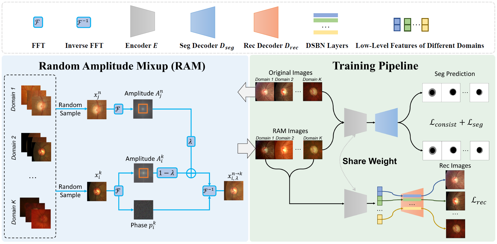

# Generalizable Medical Image Segmentation via Random Amplitude Mixup and Domain Specific Image Restoration
by [Ziqi Zhou](https://zzzqzhou.github.io/), [Lei Qi](http://palm.seu.edu.cn/qilei/), [Yinghuan Shi](https://cs.nju.edu.cn/shiyh/index.htm). 

## Introduction

This repository is for our ECCV 2022 paper: **[Generalizable Medical Image Segmentation via Random Amplitude Mixup and Domain-Specific Image Restoration](https://arxiv.org/pdf/2208.03901.pdf)**.




## Pytorch Implementation

### Clone this repository

```
git clone https://github.com/zzzqzhou/RAM-DSIR.git
cd RAM-DSIR
```

### Download Dataset

#### Fundus
Download dataset [Fundus](https://drive.google.com/file/d/1p33nsWQaiZMAgsruDoJLyatoq5XAH-TH/view) (Provided by [DoFE](https://github.com/emma-sjwang/Dofe)) and put images in ```./dataset/fundus/```

#### Prostate
Download our pre-processed dataset [Prostate](https://drive.google.com/file/d/1sx2FpNySQNjU6_zBa4DPnb9RAmesN0P6/view?usp=sharing) (Originally Provided by [SAML](https://liuquande.github.io/SAML/)) and put data in ```./dataset/prostate/```


### Training and Testing
The training and testing process can all be done on one Nvidia RTX 2080Ti GPU with 11 GB memory.

Train on Fundus Dataset (Target Domain 0)
```
cd code
python -W ignore train.py --data_root ../dataset --dataset fundus --domain_idxs 1,2,3 --test_domain_idx 0 --ram --rec --is_out_domain --consistency --consistency_type kd --save_path ../outdir/fundus/target0 --gpu 0
```

Test on Fundus Dataset (Target Domain 0)
```
cd code
python -W ignore test_fundus_slice.py --model_file ../outdir/fundus/target0/final_model.pth --dataset fundus --data_dir ../dataset --datasetTest 0 --test_prediction_save_path ../results/fundus/target0 --save_result --gpu 0
```


## Acknowledgement
Our implementation is heavily drived from [Fed-DG](https://github.com/liuquande/FedDG-ELCFS) and [DoFE](https://github.com/emma-sjwang/Dofe). Thanks to their great work.


## Citation

If you find this project useful for your research, please consider citing:

```bibtex
@inproceedings{zhou2022ram_dsir,
  title={Generalizable Medical Image Segmentation via Random Amplitude Mixup and Domain Specific Image Restoration},
  author={Zhou, Ziqi and Qi, Lei and Shi, Yinghuan},
  booktitle={ECCV},
  year={2022}
}
```
